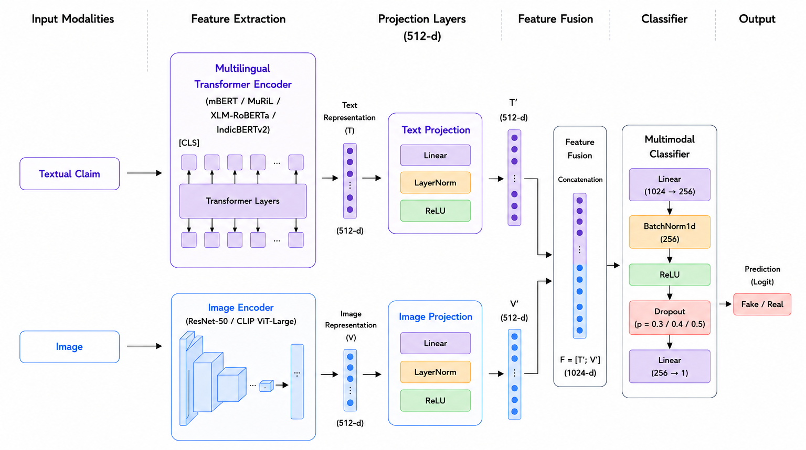

# IMMFND_Benchmarks

## Indian Multilingual Multimodal Fake News Detection Benchmarks
IMMFND_Benchmarks is a benchmark repository for multilingual fake news detection experiments conducted on the IMMFND dataset.

The repository contains:

- Text-only transformer baselines
- Multimodal transformer-based fusion models
- Benchmarking across multilingual transformer architectures
- Experimental evaluations using multiple dropout configurations

The repository focuses on multilingual misinformation detection using both textual and visual modalities.

---

# Supported Models

## Text-Only Models

The following multilingual transformer models are benchmarked:

- mBERT (`bert-base-multilingual-cased`)
- MuRIL (`google/muril-base-cased`)
- XLM-RoBERTa (`xlm-roberta-base`)
- IndicBERTv2 (`ai4bharat/IndicBERTv2-MLM-Sam-TLM`)

---

# Multimodal Models

## Text + ResNet50 Fusion

A multimodal fusion architecture combining:

- multilingual transformer text embeddings
- ResNet50 image embeddings

using feature-level fusion for fake news classification.

---

## Text + CLIP Fusion

A multimodal architecture combining:

- multilingual transformer text embeddings
- CLIP visual embeddings (`openai/clip-vit-large-patch14`)

for multimodal misinformation detection.

---

# Experimental Configurations

The multimodal experiments were conducted using multiple dropout configurations:

- 0.3
- 0.4
- 0.5

The current repository release contains:

- training scripts
- benchmark results
- architecture of multimodal fine tuning

---

# Repository Structure
```text
IMMFND_Benchmarks/
│
├── src/
│   └── training/
│       ├── train_text_models.py
│       ├── train_multimodal_resnet.py
│       └── train_multimodal_clip.py
│
├── data/
│   └── Final_Dataset/
│       │
│       ├── train/
│       │   │
│       │   ├── Fake/
│       │   │   ├── Fake_text.xlsx
│       │   │   └── Fake_image/
│       │   └── Real/
│       │       ├── Real_text.xlsx
│       │       └── Real_image/
│       │
│       ├── validation/
│       │   │
│       │   ├── Fake/
│       │   │   ├── Fake_text.xlsx
│       │   │   └── Fake_image/
│       │   │
│       │   └── Real/
│       │       ├── Real_text.xlsx
│       │       └── Real_image/
│       │
│       └── test/
│           │
│           ├── Fake/
│           │   ├── Fake_text.xlsx
│           │   └── Fake_image/
│           │
│           └── Real/
│               ├── Real_text.xlsx
│               └── Real_image/
│
├── demo_dataset/
│   └── sample_data_link.txt
│
├── requirements.txt
├── README.md
└── LICENSE
```

---

# Dataset Structure

The training scripts expect the dataset to follow the exact directory structure shown above.

Each split must contain:

- Fake claims
- Real claims
- Corresponding image folders

---

# Required Excel File Format

The Excel files must contain the following columns:

| Column Name | Description |
|---|---|
| `claim` | Textual claim |
| `Sr. No` | Unique sample identifier used to map images |

---

# Image Naming Convention

Images inside:

- `Fake_image/`
- `Real_image/`

must be named using the corresponding `Sr. No` value.

Example:

```text
article101.jpg
article101.png
article102.jpg
```

---

# Demo Dataset

The complete IMMFND dataset is currently not publicly released due to ongoing research and conference submission processes.

A small demo dataset is provided for reproducibility and framework demonstration purposes.

## Demo Dataset Link

```text
<https://drive.google.com/file/d/1eqg36sMyrG0XBIRGWkg7YecbB1CSILLO/view>
```

The demo dataset preserves the same directory structure as the complete dataset.

---

# Installation

## 1. Clone the Repository

```bash
git clone <https://github.com/amrutha9k/IMMFND_Benchmarks>
cd IMMFND_Benchmarks
```

---

## 2. Install Dependencies

```
pip install -r requirements.txt
```

---

# Running Experiments

## Text-Only Baselines

```bash
python src/training/train_text_models.py
```

### Outputs

- trained checkpoints
- `model_results_text.csv`

---

# Multimodal ResNet50 Fusion

```bash
python src/training/train_multimodal_resnet.py
```

### Outputs

- multimodal checkpoints
- `resnet_multimodal_results_dropoutval.csv`

---

# Multimodal CLIP Fusion

```bash
python src/training/train_multimodal_clip.py
```

### Outputs

- multimodal checkpoints
- `clip_multimodal_results_dropoutval.csv`

---

# Training Details

| Parameter | Value |
|---|---|
| Epochs | 20 |
| Batch Size | 32 |
| Learning Rate | 1e-5 |
| Max Sequence Length | 128 |
| Early Stopping Patience | 5 |

---

## Architecture

<p align="center">
  
</p>

# Text-Only Fine-Tuning Results

| Model | Accuracy (%) | F1-Macro (%) | Precision (%) | Recall (%) |
|---|---|---|---|---|
| mBERT | 78.58 | 78.49 | 78.51 | 78.47 |
| MuRIL | 80.35 | 80.33 | 80.34 | 80.44 |
| XLM-RoBERTa | 79.52 | 79.47 | 79.45 | 79.51 |
| IndicBERTv2 | 81.51 | 81.50 | 81.55 | 81.66 |

---

## Multimodal Benchmark Results

To evaluate the impact of integrating textual and visual information, multilingual transformer encoders were combined with two image backbones: **ResNet-50** and **CLIP ViT-Large**. Experiments were conducted using dropout values of **0.3, 0.4, and 0.5** across all model combinations.

For each image encoder, the best-performing configuration is reported below.

- **CLIP ViT-Large** consistently outperformed ResNet-50 across multimodal experiments, demonstrating the effectiveness of pretrained multimodal representations.
- The strongest overall performance was achieved by **IndicBERTv2 + CLIP ViT-Large** with a dropout value of **0.3**.
- Within ResNet-based configurations, **IndicBERTv2 + ResNet50** produced the highest performance among all evaluated ResNet combinations.

| Text Encoder | Image Encoder | Dropout | Accuracy | F1-Macro |
|--------------|--------------|----------|-----------|-----------|
| IndicBERTv2 | CLIP ViT-Large | 0.3 | **90.24** | **90.14** |
| IndicBERTv2 | ResNet50 | 0.3 | 89.31 | 89.24 |

### Key Observation

The multimodal framework achieved a substantial improvement over text-only baselines, highlighting the importance of combining visual evidence with multilingual textual representations for fake news detection. The best multimodal configuration achieved approximately **9% improvement** over the strongest text-only baseline.

---

# Features

- Multilingual fake news detection
- Transformer-based text classification
- Multimodal fusion architectures
- CLIP-based image feature extraction
- ResNet50-based image feature extraction
- Early stopping
- Mixed precision training
- Checkpoint saving
- Automatic evaluation and CSV export

---

# Citation

If you use this repository in research, please cite:

```text
IMMFND_Benchmarks: Indian Multilingual Multimodal Fake News Detection Benchmarking using Transformer and Vision-Language Models.
```

---

# License

This repository is intended for academic and research purposes.
